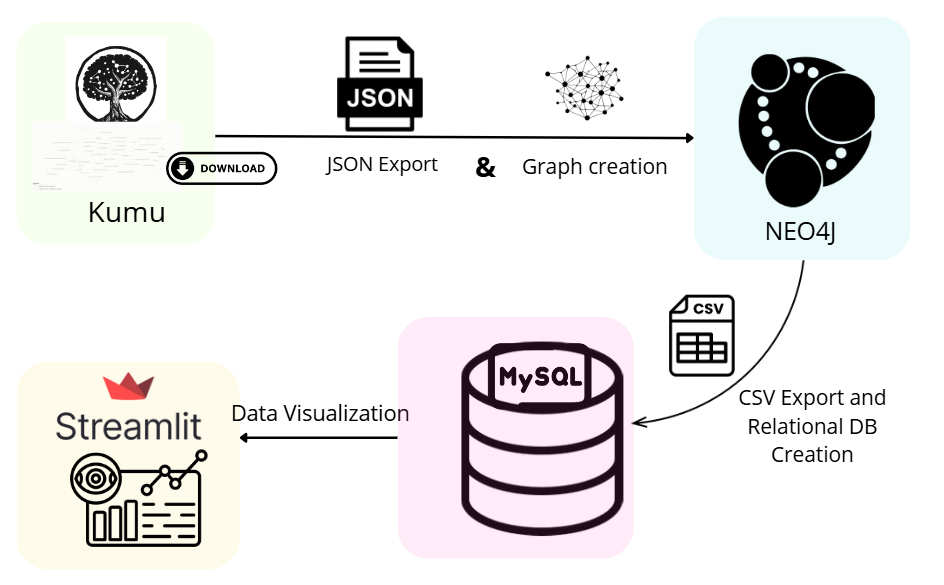

# CLD-Explorer
So far il workflow è il seguente:
- Creazione grafo a mano con Kumu
- Estrazione file JSON come esempio caricato
- run dello script per creazione grafo in Neo4j, specificando il gruppo per ogni cld
- run delle query interne a neo4j: le 4 query caricate per ogni CLD
- Download manuale dei CSV dei risultati da Neo4j e salvati in locale
- Run degli 4 script per nodi, rel, loops e routes per ogni cld per creaazione tabelle in mysql
- creazione direttamente delle bridge tables in mysql. Di tutte le bridge tables alla fine abbiamo utilizato solo quella "bridge_nodes_loops" quindi le altre sono anche inutili, ma si tengono per magari query future.

